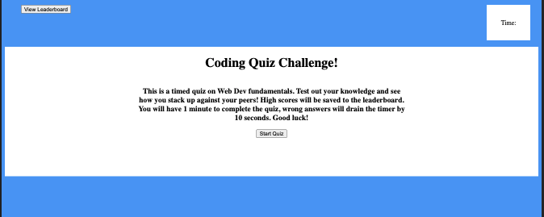
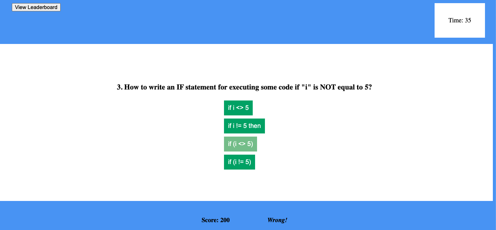

# Javascript Timed Coding Quiz!

## Table of contents

- [Overview](#overview)
  - [The challenge](#the-challenge)
  - [User Story](#user-story)
  - [Acceptance Criteria](#acceptance-criteria)
  - [Links](#links)
- [My process](#my-process)
  - [Built with](#built-with)
  - [What I learned](#what-i-learned)

## Overview

### The challenge

Build a timed coding quiz with multiple-choice questions. This app will run in the browser, 
and will feature dynamically updated HTML and CSS powered by JavaScript code that you write. 
It will have a clean, polished, and responsive user interface.

### User Story

    AS A coding boot camp student
    I WANT to take a timed quiz on JavaScript fundamentals that stores high scores
    SO THAT I can gauge my progress compared to my peers

### Acceptance Criteria

    GIVEN I am taking a code quiz
    WHEN I click the start button
    THEN a timer starts and I am presented with a question
    WHEN I answer a question
    THEN I am presented with another question
    WHEN I answer a question incorrectly
    THEN time is subtracted from the clock
    WHEN all questions are answered or the timer reaches 0
    THEN the game is over
    WHEN the game is over
    THEN I can save my initials and score

### Screenshot

### Links

- Solution URL: [https://github.com/dnsnguy08/timed_coding_quiz](https://github.com/dnsnguy08/timed_coding_quiz)
- Live Site URL: [https://dnsnguy08.github.io/timed_coding_quiz/](https://dnsnguy08.github.io/timed_coding_quiz/)

## My process

### Built with
- HTML
- CSS
- Javascript

### What I learned
Using Javascript, I was able dynamically add html elements to the page based on user interactions with Web-APIs.
I was able to create a timed quiz that retrieves past scores stored via the browser's local storage.
